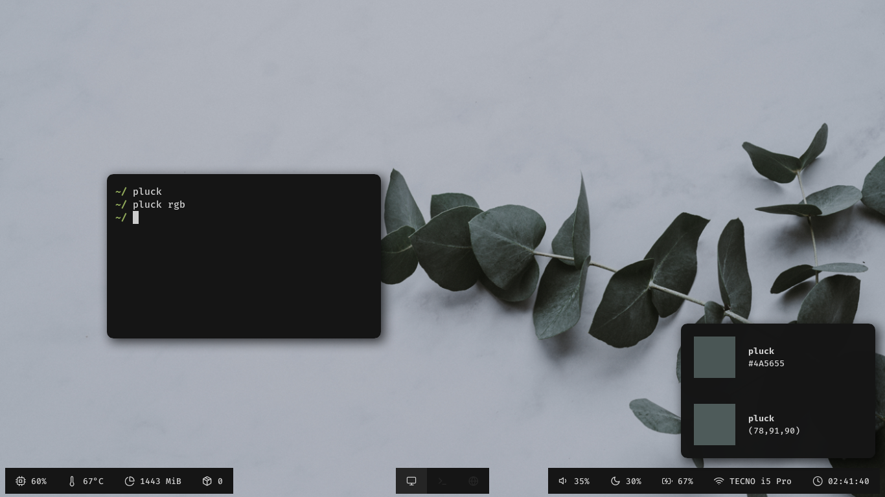

# Pluck

A X11 Color Picker

<p align="center">
  
</p>

pluck is a simple X11 color picker in Posix which uses of `xdotool` to get mouse position, `convert` for getting color values, and xclip to copy it to clipboard.
Dependencies:

```
  xdotool
  ImageMagick
  xclip
```

Install:

```
  git clone https://github.com/Manas140/pluck.git && cd pluck
  ./install.sh i
```
Usage:

```
  pluck [rgb|h]
    rgb: use rgb value instead of hex
      h: help
```

Example:

```
  pluck
```
